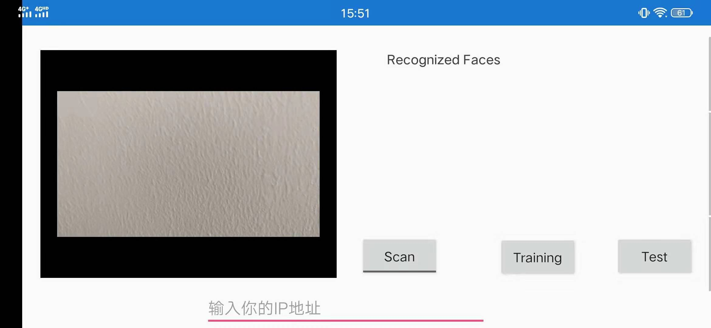
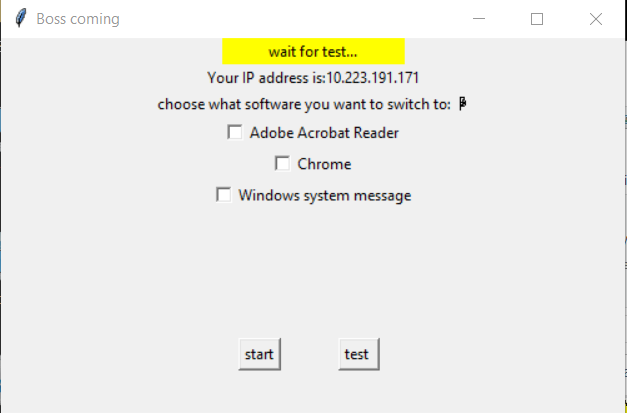

# Boss-coming: 一种基于边缘计算的移动端检测报警系统

Boss-coming 是基于手机端人脸识别技术以及UDP通信所实现的一种检测报警的系统，它可以用于一般的办公场景或者是短距离的检测场景。

### Address：
* [https://github.com/Jarvis-Cai/Boss-coming](https://github.com/Jarvis-Cai/Boss-coming)

### User Guide:
手机端APP：
1. 打开主页面
    
    该页面下会打开你的摄像头并显示到界面左侧，右侧含有三个主要功能按钮，最下边的输入框用于输入与你的电脑设备建立连接的IP地址。
2. 添加训练集：
    
    初次使用时需要先将报警目标（boss）加入训练集。在主页面当中点击 "Training" 进入上图左侧界面，输入“Boss”，然后进入采集界面（右图）。（注意：当前版本仅支持检测单目标，并且目标名称必须是“Boss”）
3. 测试UDP：
    
    在完成输入IP地址之后点击 “Test” ，IP地址的获取以及测试结果报告可通过使用releases中boss-coming.exe工程文件来测试使用。
    
    boss-coming界面如图所示
4.  检测开始：
    
    测试连接成功后，点击 “Scan” 开启检测。当检测到目标（Boss）时，将会发送警报信息到PC机当中，警报结果可使用"boss-coming.exe"来获取。在开始检测过程中，为了保持隐秘性，可以点击 “Test” 按钮，将屏幕进行遮掩，遮掩效果如下图，此时在遮掩界面中点击遮眼布可以去除遮掩布。
    
电脑端软件： 
      
    当前电脑端软件提供的切换效果包括三个功能，包括PDF reader，Chrome浏览器，以及
    window自带的消息提示窗。其中PDF阅读器和Chrome浏览器只能同时显示一个效果，同时选中
    默认选择切换效果为PDF阅读器。勾选好了后，点击start即可开始功能。  
    在开始正式开始使用软件
    的时候，可以进行一下测试，以便测试网络是否顺畅，即手机端的信息是否能及时顺畅地
    发送到目标主机。此时需手机端先点击test按钮，然后电脑端软件点击test按钮。界面最
    上端的黄色栏会相应变成绿色，并提示测试完成。表明网络路径畅通。  
    软件显示页面上端显示的IP地址，是需要填写到手机APP上的‘输入你的IP地址’一栏。  
    

### 工程使用：
* 下载并通过Android studio打开本项目文件
* 按照本地编译器环境重新配置build.gradle文件
* 编译后在 "BossComing_master\facerecognition\build\outputs\apk\debug" 路径下寻找到apk文件并在手机端安装（或者直接安装）。
* 按照User Guide进行检测操作。

### 当前问题：
测试准确度还可以进一步提高，检测距离有限（1-2m）。

----
**Version:1.0.0**
